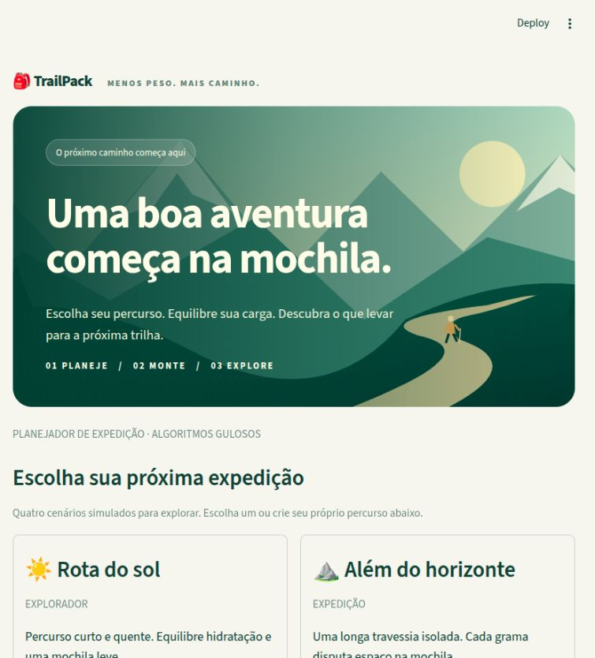
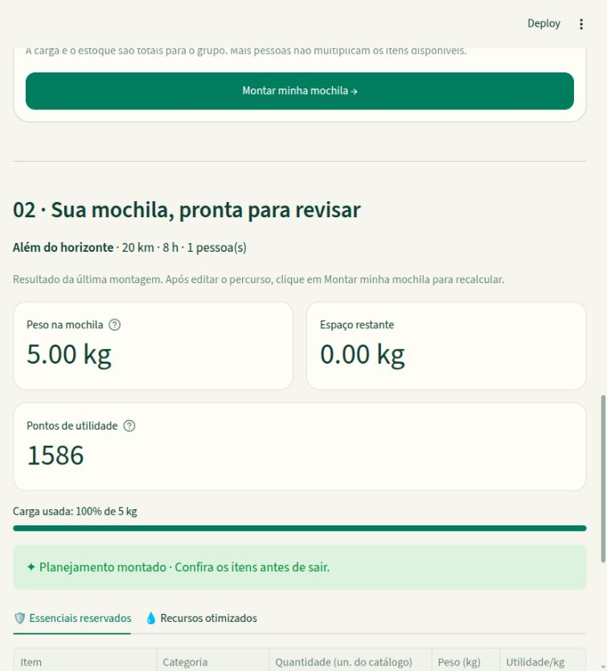
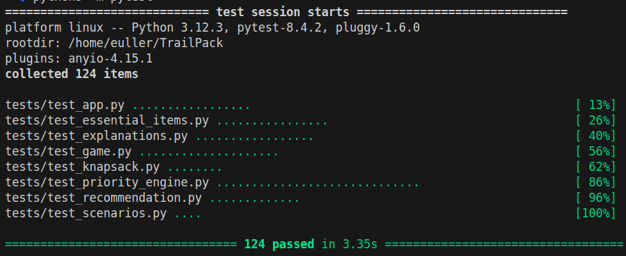

# TrailPack

**Conteúdo da Disciplina:** Algoritmos Gulosos

## Alunos

| Matrícula | Aluno |
| -- | -- |
| 23/1011838 | Tiago Antunes Balieiro |
| 23/1026714 | Euller Júlio da Silva |

## Apresentação do trabalho

O vídeo de apresentação pode ser encontrado [neste link](https://youtu.be/K49hXJ0Ywyg).

## Sobre

O **TrailPack** é um projeto de aplicação web para auxiliar no planejamento de
mochilas para trilhas. A proposta é considerar as características do percurso,
os itens disponíveis e a capacidade máxima de carga para sugerir uma composição
de mochila adequada ao cenário informado.

O planejamento levará em conta distância, duração, dificuldade, temperatura,
chuva, isolamento, disponibilidade de água durante o trajeto e quantidade de
pessoas. Essas condições serão utilizadas para calcular a utilidade contextual
dos recursos: por exemplo, uma trilha longa e quente, sem pontos de água,
aumentará a prioridade da hidratação.

A solução distinguirá **itens indivisíveis**, como lanterna, apito e kit de
primeiros socorros, de **recursos divisíveis**, como água, alimentos e isotônico.
Os itens essenciais selecionados terão seu peso reservado antes da otimização.
Na capacidade restante, será aplicada uma implementação manual do algoritmo
guloso de **Knapsack Fracionário** (problema da mochila fracionária).

O algoritmo ordenará os recursos pela razão entre utilidade e peso, selecionando
primeiro os de maior razão. Quando um recurso não couber integralmente, apenas
a fração que cabe será selecionada. Essa estratégia maximiza a utilidade no
subproblema fracionário, considerando valores lineares e a capacidade restante
após a reserva dos essenciais. A ordenação terá complexidade de tempo
**O(n log n)**, seguida de uma seleção **O(n)**, para `n` recursos divisíveis.

A [documentação do algoritmo e da análise de complexidade](docs/algoritmo.md)
apresenta as etapas da implementação, a justificativa da escolha gulosa,
um exemplo de execução e os custos de tempo e espaço.

**Estado atual:** o catálogo, o perfil da trilha, as prioridades contextuais,
a reserva de essenciais e o Knapsack Fracionário estão integrados à interface.
É possível configurar o percurso, montar a mochila, consultar o resultado e
baixar um checklist. Quatro cenários simulados preenchem o formulário: Rota do
sol, Além do horizonte, Serra gelada e Caminho das águas. Também é possível
selecionar e editar o estoque, adicionar itens personalizados, consultar as
justificativas e a tabela de otimização e comparar a mochila do jogador com
a solução gulosa no Desafio TrailPack.

## Screenshots



*Ilustração de trilha e seleção de cenários simulados.*



*Peso, espaço restante e pontos de utilidade da última montagem.*

## Instalação

**Linguagem:** Python 3.10+<br>
**Framework:** Streamlit<br>
**Bibliotecas:** Pandas para tabelas e Pytest para testes

Pré-requisitos:

- Python 3.10 ou superior;
- Git;
- acesso à internet para clonar o projeto e instalar as dependências;
- acesso ao repositório no GitHub, enquanto ele estiver privado.

Clone o projeto e entre no diretório:

```bash
git clone https://github.com/projeto-de-algoritmos-2026/TrailPack.git
cd TrailPack
```

Na raiz do projeto, crie e ative um ambiente virtual no Linux ou macOS:

```bash
python3 -m venv .venv
source .venv/bin/activate
```

No Windows, crie e ative o ambiente pelo PowerShell:

```powershell
py -3 -m venv .venv
.venv\Scripts\Activate.ps1
```

Instale as dependências no ambiente ativo:

```bash
python -m pip install -r requirements.txt
```

## Execução

Com o ambiente virtual ativo e o terminal na raiz do projeto:

```bash
python -m streamlit run app.py
```

O Streamlit informará o endereço local da aplicação, normalmente
`http://localhost:8501`. Abra esse endereço no navegador e mantenha o terminal
aberto enquanto usa a aplicação. Para encerrar, pressione **Ctrl+C**.

Não são necessárias chaves de API, banco de dados ou arquivo `.env` para
executar o projeto localmente. O catálogo e os cenários são lidos de `data/`.

O [guia de instalação e execução](docs/instalacao.md) detalha a preparação do
ambiente, os comandos para Windows, os testes e a solução de problemas comuns.

## Testes

Na raiz do projeto e com as dependências instaladas, execute a suíte completa:

```bash
python -m pytest -q
```



*Resultado da execução da suíte de testes com 100% de aprovação.*

Para executar apenas os testes do algoritmo:

```bash
python -m pytest -q tests/test_knapsack.py
```

Os testes de interface usam o Streamlit AppTest, sem precisar iniciar um
servidor manualmente ou abrir o navegador.

## Uso

1. Escolha uma das quatro expedições ou preencha seu próprio percurso.
2. Ajuste distância, duração, clima, dificuldade, isolamento, água disponível,
   número de pessoas e capacidade total de carga.
3. Selecione os itens disponíveis e ajuste suas quantidades e pesos. Para
   incluir um item próprio, use **Adicionar item personalizado** e depois
   selecione-o na lista.
4. Clique em **Montar minha mochila**. O sistema reserva os essenciais e os
   equipamentos selecionados e otimiza os consumíveis na carga restante.
5. Confira peso, capacidade restante, pontos de utilidade, justificativas e
   a tabela de otimização.
6. No **Desafio TrailPack**, escolha quantidades de consumíveis e clique em
   **Comparar com o algoritmo** para ver os scores e a eficiência percentual.
7. Baixe o checklist para revisar a seleção. Após editar o percurso ou estoque, clique
   novamente em **Montar minha mochila** para atualizar o resultado.

A capacidade e o estoque são totais para o grupo. Equipamentos opcionais
entram na mochila quando selecionados pelo usuário. Se os itens reservados
não couberem, a interface informa o conflito. Edições de estoque e itens
personalizados ficam na sessão do usuário e não alteram o catálogo em disco.
Os pontos são heurísticos: não garantem suficiência dos recursos para uma
trilha real.

## Outros

### Organização do projeto

```text
TrailPack/
├── app.py              # Entrada da interface Streamlit
├── README.md
├── requirements.txt
├── .gitignore
├── src/
│   ├── __init__.py
│   ├── models.py       # Contratos de domínio
│   ├── trail_profile.py
│   ├── priority_engine.py
│   ├── essential_items.py
│   ├── knapsack.py
│   ├── recommendation.py
│   ├── scenarios.py
│   ├── explanations.py
│   ├── item_editor.py
│   ├── game.py
│   ├── game_ui.py
│   └── ui.py
├── assets/             # Ilustração vetorial local da paisagem
├── data/               # Catálogo e quatro cenários simulados
├── scripts/            # Reprodução dos resultados
├── tests/              # Testes automatizados
└── docs/               # Documentação complementar
```

### Convenções dos modelos

- Pesos e capacidade em quilogramas, distância em quilômetros, duração em horas
  e temperatura em graus Celsius.
- O peso e o valor base de um item representam uma unidade do recurso.
- Itens indivisíveis exigem quantidades inteiras; recursos divisíveis aceitam
  quantidades fracionárias.
- O modelo de recomendação calcula o peso total e a capacidade restante e
  rejeita uma seleção que exceda a capacidade da mochila.

### Resultados

Veja os [cenários e resultados reproduzíveis](docs/resultados.md), incluindo
quatro mochilas calculadas e um desafio com eficiência de 88,26%.

```bash
python -m scripts.reproduce_results
```
